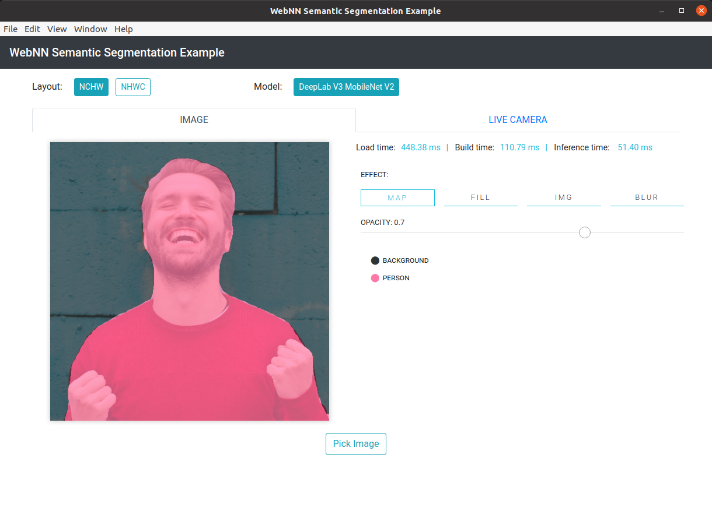

# An Electron.js example of Semantic Segmentation using webnn-native

### Install

Firstly, ensure that you have done these steps in [README.md](/node/README.md), then run:
```bash
npm install
```

### Run

```bash
npm start
```

You can also run multiple times with "numRuns" to get the median inference time, for example:
```bash
npm start numRuns=100
```

### Package

Bundles source code with a renamed Electron executable and supporting files into `out` folder ready for distribution.

```bash
npm run package
```

### Distribution

Creates a distributable using Electron Forge's `make` command:

```bash
npm run make
```

### Screenshot

