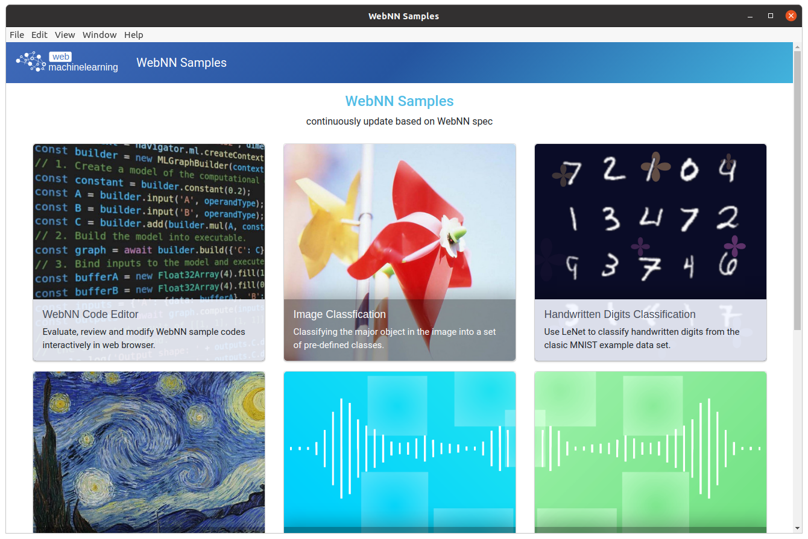

# Electron.js examples of WebNN using webnn-native

This is an all-in-one Electron.js app that reuses the WebNN samples from https://github.com/webmachinelearning/webnn-samples running on WebNN node.js addon with implementation of webnn-native.

### Install

Firstly, ensure that you have done these steps in [README.md](/node/README.md), then run:
```bash
npm install
```

### Run

```bash
npm start
```

### Run with parameters

- `sample`: typeof `string`, one of the array ["code", "image_classification", "lenet", "nsnet2", "object_detection", "rnnoise", "semantic_segmentation", "style_transfer"], used for directly entering the specificed sample entry, e.g.:
```
npm start sample=image_classification
```

- `numRuns`: typeof `number`, used for runing inference multiple times to get the median inference time, e.g.:
```bash
npm start numRuns=100
```

### Package

Bundles source code with a renamed Electron executable and supporting files into `out` folder ready for distribution.

```bash
npm run package
```

### Distribution

Creates a distributable using Electron Forge's `make` command:

```bash
npm run make
```

### Screenshot



### Note

Currently NSNet2 is not supported since lacking of some ops implementation in webnn-native.